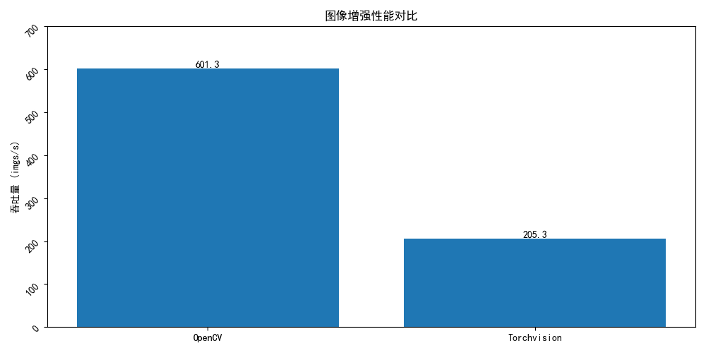
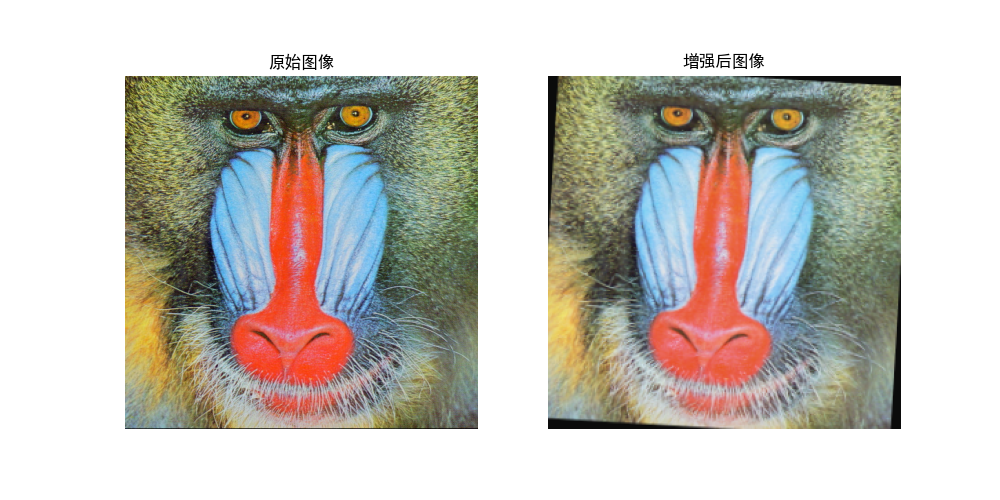
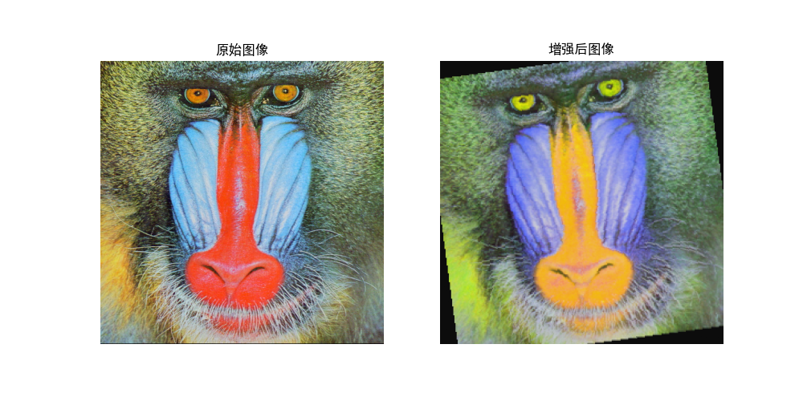

# 图像增强性能实验报告

**实验日期**: 2025-05-24 23:10  
**测试图像数量**: 3

## 性能对比结果

| 指标 | OpenCV | Torchvision |
|------|--------|-------------|
| 平均处理时间(s) | 0.0016 ± 0.0003 | 0.0050 ± 0.0008 |
| 吞吐量(imgs/s) | 620.1 | 198.5 |

**加速比**: 3.12x

## 增强效果示例

### OpenCV 增强结果

### Torchvision 增强结果

